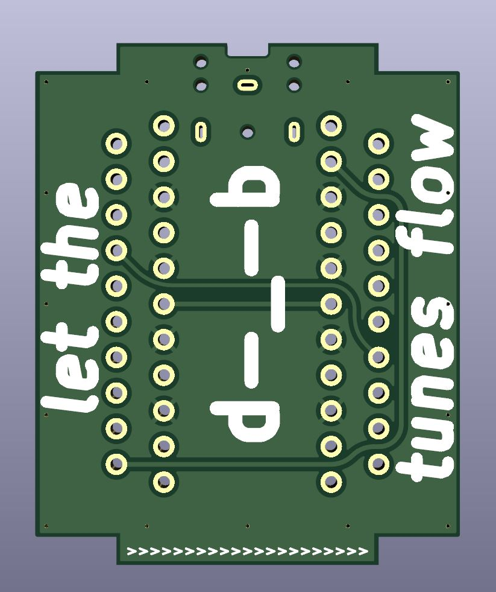
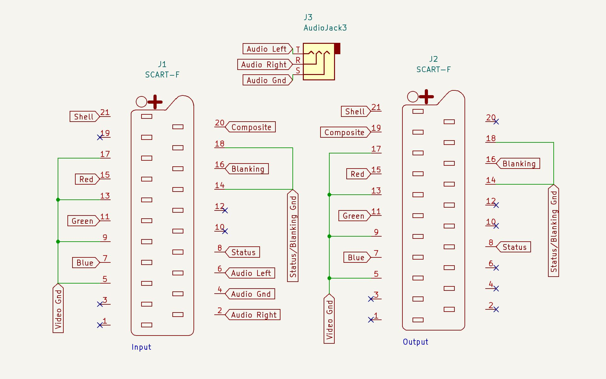

# SCARTAudioExtractor
This is a PCB that acts as a SCART female-to-female coupler/gender changer, but extracts the audio from the input to a 3.5mm TRS jack (EuroSCART only).

Note: Has not yet been used, only tested with multimeter.

# Why/About

I have several older game consoles that output their video and audio over SCART, and I often want to listen to the game audio with headphones.

I designed this board because the few products that extract audio from a SCART cable either terminate to RCA jacks, are out of stock, or do not support RGB (This being said, create an issue if you would like a version that uses RCA jacks instead).

This board must be right before your display! Audio is completely removed from the SCART cable, and you will not get audio from the output SCART connector. This coupler also does not support daisy chaining and removes the mostly unused D2B bus signals as well.

# What you'll need

The PCB, of which gerbers are available for in the repo. The PCB can be ordered from any board house, some examples of which are [Oshpark](https://oshpark.com/#services), [PCBWay](https://www.pcbway.com/QuickOrderOnline.aspx) or [JLCPCB](https://cart.jlcpcb.com/quote). The PCB was designed with PCBWay in mind as the board house, so it has a marker for their production numbers. You may want/need to edit this out before ordering from another board house.

2 Female SCART Connectors (specifically, [KYCON_SCART_K-SCARTX-022_Horizontal](https://www.mouser.com/datasheet/2/222/K-SCARTX-022-183347.pdf)). No major suppliers carry SCART connectors anymore as far as I'm aware, you can find listings on Aliexpress [here (LR Ear)](https://www.aliexpress.us/item/3256803860252051.html), [here (VER3)](https://www.aliexpress.us/item/2255800585241541.html) or [here (03)](https://www.aliexpress.us/item/3256806450160956.html). Ensure that the part that juts out is on the top (opposite side of the pins), the connector has ears, is a horizontal/90 degree connector, has all 21 pins (to ensure RGB support), and does not have any extra mounting methods besides the ears (e.g, screw holes).

1 Female 3.5mm TRS Jack (specifically, [Jack_3.5mm_CUI_SJ1-3523N_Horizontal](https://www.cuidevices.com/product/resource/pdf/sj1-352xn.pdf)). This can be bought from [Mouser](https://www.mouser.com/ProductDetail/CUI-Devices/SJ1-3523N?qs=WyjlAZoYn50aNl0vAhb3Tg%3D%3D), [Digikey](https://www.digikey.com/en/products/detail/cui-devices/SJ1-3523N/738689) or Aliexpress [here](https://www.aliexpress.us/item/2251832685563184.html), [here](https://www.aliexpress.us/item/3256803939752840.html) or [here](https://www.aliexpress.us/item/3256805272161608.html).

Basic soldering equipment.

(Optional) Rubber feet or a case of some sort

# PCB Images

# TODO

Design a 3D printable shell to protect against shorts/damage to the board.
